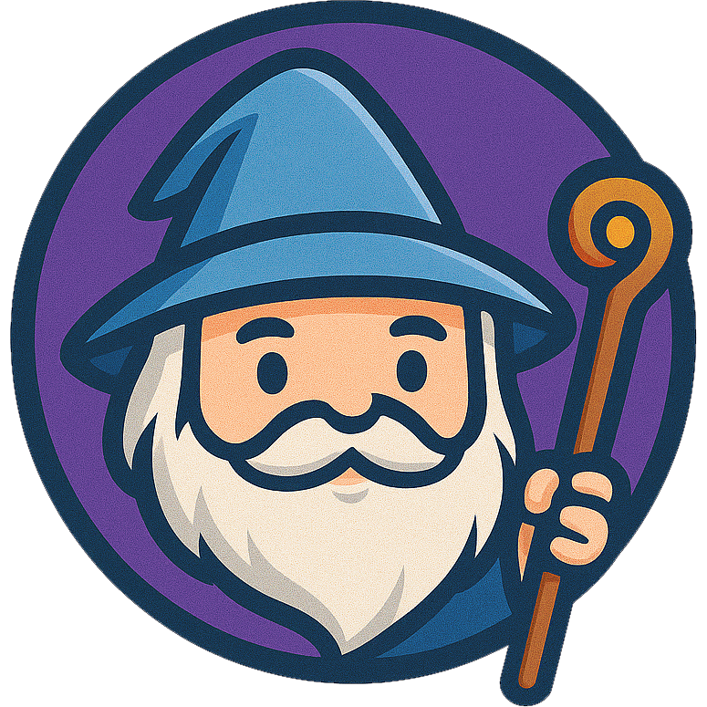

<p align="center">
  
</p>

# Gandalf the Gatekeeper – AI-Powered Bot Detection & Traffic Protection

**Built for Norrsken Fixathon 2025 – AI Safety Challenge 1: Aligned Intelligence**

<p align="center">
  
</p>

Gandalf the Gatekeeper is an AI-powered security layer that protects applications from large-scale misuse of headless browsers and harmful automation. By combining behavioral analysis, swarm detection, trust token verification, and adaptive traffic control, Gandalf distinguishes between legitimate users, good automation, and malicious bot swarms in real time.

**This project was designed and built during the Fixathon by the SU Heroes team.**

---

## 📌 Quick Links & Resources

**Live Gateway:**  
https://gandalf-gateway-fkbsfhcdlq-uc.a.run.app

**Monitor Page:**  
https://gandalf-norrsken.lovable.app

**Protected Application:**  
https://gandalf-gateway-839375693600.us-central1.run.app

**Dashboard:**  
https://gandalf-norrsken.lovable.app/logs

**GitHub Repository:**  
https://github.com/poompoowit/gandalf-norrsken

**Demo Video:**
https://youtu.be/Fcqh9bwEr_Q

**Pitch Deck:**
https://gandalf-norrsken.lovable.app/pitch

If you have questions, reach out via LinkedIn or email **hello@jadypamella.com**.

---


---

## 🎯 Problem Overview

Modern automation ecosystems depend heavily on browser-based agents and scripts.  
At the same time, attackers can deploy **thousands of AI-controlled headless browser sessions**, producing harmful traffic that:

- Overloads systems  
- Performs credential stuffing  
- Automates scraping  
- Bypasses naive user checks  
- Evades traditional rate limits  

Meanwhile, legitimate automation such as monitoring agents, integrations, and accessibility tools must continue functioning.

**The challenge is not to stop automation — it’s to stop harmful automation without harming the good.**

---

## ✨ Solution Summary

Gandalf, the Gatekeeper, sits in front of any application, acting as an intelligent mediator between incoming traffic and the protected system. Gandalf performs:

- **Behavioral risk scoring** based on velocity, timing, fingerprint similarity, and anomalies  
- **Swarm detection** using a 60-second window of coordinated activity  
- **Trust token verification** via RFC 9421 HTTP Message Signatures  
- **Human-friendly challenge-response** for suspicious requests  
- **Adaptive traffic control** with allow, throttle, challenge, and block decisions  
- **Real-time analytics** through a dedicated dashboard

---

## 🚀 Key Features

### Behavioral Analysis Engine  
Scores every request (0–100) based on:

- Timing patterns  
- Repetition and traversal paths  
- Fingerprint stability  
- Request velocity  

### Swarm Detection  
Detects 5+ matching session fingerprints inside a 60-second sliding window.

### Trust Tokens (RFC 9421 Message Signatures)  
Good bots sign requests to verify legitimacy.

### Adaptive Rate Limiting  
30 requests per minute with dynamic thresholds.

### Challenge-Response  
Low-friction challenge for suspicious traffic.

### Real-time Dashboard  
Visualizes requests, risk scores, sessions, fingerprints, and decisions.

---

## 🧠 AI Safety Principles

| Principle | Framework | Implementation |
|-----------|-----------|----------------|
| **Transparency** | OECD AI Principles | Real-time scoring and decision logs |
| **Human Oversight** | EU AI Act | Humans tune thresholds and policies |
| **Robustness** | NIST AI RMF | Fingerprint analysis + swarm detection |
| **Misuse Prevention** | AI Safety Ecosystem | Stops large-scale automation abuse |

---

## ⚙️ System Architecture

```
Incoming Traffic
    ↓
Fingerprinting Engine
    ↓
Behavioral Scoring (0–100)
    ↓
Swarm Detection (Sliding Window: 60s)
    ↓
Trust Token Verification (RFC 9421)
    ↓
Decision Engine
    • Allow
    • Throttle
    • Challenge
    • Block
    ↓
Protected Application
    ↓
Analytics Dashboard (Real-time Metrics)
```

---

## 📊 Features Overview

### Dashboard
- Real-time risk scores  
- Swarm detection alerts  
- Fingerprint clustering  
- Live session analysis  
- Decision logs  

### Monitor Page
- Health and diagnostic view  

### Protected Application
- Demonstrates Gandalf’s traffic mediation  

---

## 🧪 Test Suite

### Challenge 1 Tests
- Gateway health check  
- Monitor endpoint  
- Metrics and dashboard validation  
- Good bot behavior  
- Aggressive swarm detection  

### Extended Tests
- Tzafon AI headless browser traffic  
- Artillery load tests  
- Python bot simulation  
- Trust token verification tests  

---

## 🌱 Impact

Gandalf helps organizations:

- Prevent large-scale bot-based abuse  
- Support legitimate automation  
- Reduce system overload  
- Improve operational safety  
- Maintain transparent audit logs  
- Build trust in automated environments  

This shifts traffic protection from reactive to proactive.

---

## 👥 Team – SU Heroes

| Name | Role | LinkedIn |
|------|------|----------|
| **Jady Pamella** | AI & Technology Leader | [linkedin.com/in/jadypamella](https://www.linkedin.com/in/jadypamella/) |
| **Phuwit Vititayanon** | AI Maker, Data Scientist | [linkedin.com/in/phuwit-vititayanon](https://www.linkedin.com/in/phuwit-vititayanon-4b6503157/) |
| **Supun Chathuranga** | AI Engineer | [linkedin.com/in/supun-chathuranga](https://www.linkedin.com/in/supun-chathuranga-190372148/) |

---

## 🛠 Tech Stack

### Gateway (This Repository)
- Node.js 20  
- TypeScript  
- Express.js  
- Nginx (optional)  
- Redis (optional for session memory)  
- Behavioral scoring engine  
- Swarm detection engine  

### Dashboard
- React + Vite  
- TypeScript  
- Tailwind + shadcn UI  
- Live metrics  

### Deployment
- Google Cloud Run  
- Docker  
- Public endpoints for evaluation  

---

## 🏗 What Was Built During the Fixathon

### Built During the Event
- Behavioral scoring system  
- Swarm detection algorithm  
- Risk thresholds and adaptive responses  
- Real-time dashboard  
- Cloud Run deployment  
- Tzafon AI simulation integration  
- Full documentation and testing  

### Pre-Fixathon
- Basic gateway proxy  
- Minimal trust token parser  
- Simple mock target app  

---

## 📂 Project Structure

```
gateway/
├── src/
│   ├── scoring/
│   ├── swarm/
│   ├── tokens/
│   ├── routes/
│   └── utils/
├── tests/
dashboard/
├── src/
└── public/
```

---

## 📝 License

MIT License – Norrsken Fixathon 2025 Submission

---

## 📬 Contact

- Email: hello@jadypamella.com  

---

**Built with love to make automation safer for everyone.**
